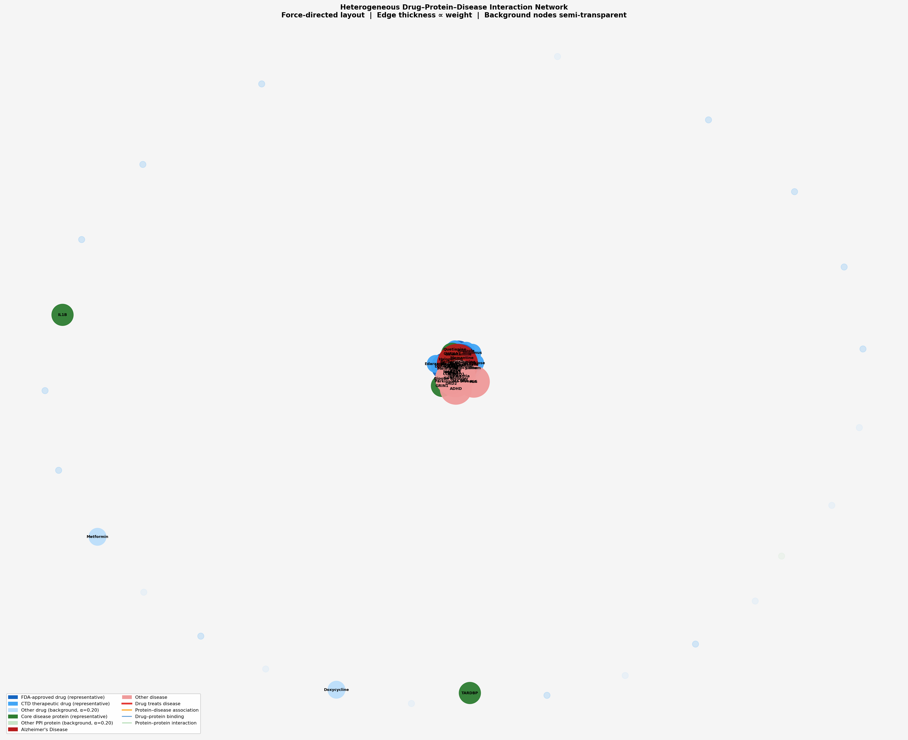

# Drug Discovery GNN: Targeting Alzheimer's Disease

This project utilizes a **Heterogeneous Graph Neural Network (GNN)** to predict novel drug-disease interactions, with a specific focus on the **Tau and Amyloid-beta interactome** for Alzheimer's Disease (AD).

Developed for scientific reproducibility (ISEF standard), the pipeline integrates chemical informatics, protein-protein interaction (PPI) data, and deep learning on graphs.

## 🚀 Recent Updates
- **New Dataset Integration**: Transitioned to a high-density protein interaction network focused on Amyloid-beta and Tau protein pathways.
- **Improved Drug Featurization**: Integrated advanced numerical vector representations for drugs, enhancing the model's ability to learn chemical properties.
- **Link Prediction Architecture**: Refactored the GNN into a link prediction model, allowing it to predict the probability of *any* drug treating Alzheimer's, rather than simple classification.
- **Demo Mode**: Added an automated inference script and a Google Colab demo for easy model testing.

## 📊 Network Visualization
The model operates on a complex biological network connecting drugs, proteins, and diseases. Below is a visual representation of the core network:



## 🛠️ Getting Started

### Prerequisites
- Python 3.10+
- [Conda](https://docs.conda.io/en/latest/) (Recommended)

### Setup
Run the provided setup script to create the environment and install dependencies:
```bash
chmod +x setup_m2.sh
./setup_m2.sh
conda activate drug_discovery_gcn
```

Alternatively, install via pip:
```bash
pip install torch torch-geometric pandas rdkit scikit-learn matplotlib networkx
```

## 📂 Project Structure
- `00_Raw_Data/`: Original drug and protein datasets.
- `01_Cleaned_Data/`: Processed graph objects and model checkpoints.
- `02_Code/`:
  - `03_build_hetero_graph.py`: Constructs the heterogeneous graph.
  - `04_expand_graph.py`: Adds disease nodes and associations.
  - `05_train_gcn.py`: Trains the HeteroGNN for link prediction.
  - `06_inference.py`: **Main Tool** for predicting drug interactions.
  - `07_visualize_graph.py`: Generates the network visualization.
- `99_ISEF_Docs/`: Technical reports and result logs.

## 🔍 Accessing the Network & Predictions

### 1. Run Inference (Predict a Drug)
You can predict the therapeutic potential of any drug in our library for Alzheimer's:
```bash
python3 02_Code/06_inference.py "Donepezil"
```
*Example Output:*
> Probability of interaction: 0.9984
> Result: High Potential for therapeutic effect.

### 2. Interactive Demo
Try the model in your browser using our **Google Colab Notebook**:
[Link to Colab Demo](Drug_Discovery_GNN_Demo.ipynb) *(Note: Open this file in Google Colab)*

### 3. Training the Model
To re-train the model on new data:
```bash
python3 02_Code/03_build_hetero_graph.py
python3 02_Code/04_expand_graph.py
python3 02_Code/05_train_gcn.py
```

## 🧪 Scientific Approach
Our GNN model uses **HeteroConv** layers with **SAGEConv** operators to perform message passing across different edge types:
- `(drug, binds, protein)`
- `(protein, interacts_with, protein)`
- `(protein, associated_with, disease)`
- `(drug, treats, disease)`

By learning from known "Approved" drugs, the model identifies patterns in how drugs interact with the Tau/Amyloid-beta subnetwork to predict candidate treatments.

# Validation Suite — Drug-Disease GNN for Alzheimer's Disease

This folder contains three test scripts to verify and justify your model's
results for ISEF / science fair presentation.

---

## Prerequisites

- Model must be trained first:
  ```
  python3 02_Code/03_build_hetero_graph.py
  python3 02_Code/04_expand_graph.py
  python3 02_Code/05_train_gcn.py
  ```
- Run all scripts **from the project root directory** (not from inside `validation/`).

---

## Test 1 — Metric Test (Known Drug Benchmark)

**File:** `validation/test_01_metric.py`

**Goal:** Verify that FDA-approved AD drugs score HIGH and biologically
unrelated drugs score LOW. Computes a ROC-AUC to quantify discrimination.

**Positive controls (expect HIGH score):**
- Donepezil, Memantine, Rivastigmine, Galantamine, Lecanemab

**Negative controls (expect LOW score):**
- Amoxicillin, Metoprolol, Omeprazole, Ibuprofen

```bash
python3 validation/test_01_metric.py
```

**What to report at the science fair:**
- ROC-AUC >= 0.80 → excellent model discrimination
- Show the ranked table: approved drugs cluster at the top

---

## Test 2 — Dummy / Null Correlation Test

**File:** `validation/test_02_dummy.py`

**Goal:** Verify the model does NOT produce false positives for:
(a) Biologically inert synthetic molecules (simple alkanes)
(b) Real drugs with targets completely outside the AD protein network
(c) Nonsense/random drug names (model must not crash)

```bash
python3 validation/test_02_dummy.py
```

**What to report at the science fair:**
- All PASS statuses = model correctly rejects null inputs
- Any WARN = discuss why (is the drug secretly plausible? e.g. Insulin)

**Note on Insulin:** If Insulin scores moderately high, this is
scientifically defensible — insulin resistance is an active AD hypothesis
(the "Type 3 Diabetes" theory). This is a talking point, not a flaw.

---

## Test 3 — Discovery Screen

**File:** `validation/test_03_discovery.py`

**Goal:** Screen 35 CNS-adjacent and repurposing-candidate drugs to identify
novel AD candidates the model predicts as high-potential.

Drug families included:
- CNS drugs (antidepressants, antipsychotics)
- Anti-inflammatory / immune modulators
- Metabolic drugs (GLP-1 agonists, metformin)
- mTOR / autophagy pathway drugs
- Statins and cardiovascular drugs
- Antibiotics with neuroprotective evidence
- Negative controls (to validate the screen)

```bash
python3 validation/test_03_discovery.py
```

**Outputs:**
- Console: ranked table by tier (HIGH / MEDIUM / LOW)
- `99_ISEF_Docs/discovery_results.json` — machine-readable full results
- `99_ISEF_Docs/discovery_report.txt` — human-readable report for ISEF docs

**What to report at the science fair:**
1. Which drugs scored HIGH that are NOT already in the AD pipeline?
   → Those are your novel predictions.
2. Cross-reference novel candidates with:
   - ChEMBL / BindingDB: do they bind proteins in your PPI network?
   - ClinicalTrials.gov: are they already in unreported trials?
   - DisGeNET: protein-disease association database
3. If a drug scored HIGH + has no current AD trial + binds AD proteins
   → that is your strongest "discovery" result.

---

## Inference Script Notes

**File:** `02_Code/06_inference.py`

The reference implementation is in `validation/06_inference_reference.py`.

Key design decisions:
- Raw model output is a **logit** (unbounded real number)
- We apply `torch.sigmoid()` to convert to a probability in [0, 1]
- This is a **probability score**, not a full distribution
- For a full distribution over multiple diseases, you would run the
  predictor against all disease nodes and apply softmax — but since
  this model focuses only on Alzheimer's, a single sigmoid score is
  both correct and interpretable

Score thresholds:
```
>= 0.70  → High Potential
0.40–0.70 → Moderate Potential
< 0.40   → Low / No Predicted Correlation
```

---

## PPI Network Summary

Your STRING network (`string_interactions_1.tsv`) contains:
- **60 unique proteins** from the Tau / Amyloid-beta interactome
- **634 interaction edges**
- Combined scores range from 0.40 to 0.999 (mean ≈ 0.63)
- Key AD proteins present: MAPT (tau), BACE1, APOE, APP, TREM2, BIN1,
  PICALM, DLG4 (PSD-95), IDE, ADAM10

These are well-validated AD targets — the PPI network is scientifically
appropriate for this task and strengthens your methodology justification.

---

## Folder Structure After Running Tests

```
99_ISEF_Docs/
  metric_test_results.json     ← Test 1 output
  dummy_test_results.json      ← Test 2 output
  discovery_results.json       ← Test 3 machine-readable
  discovery_report.txt         ← Test 3 human-readable
```
